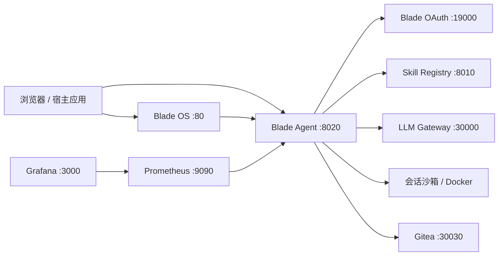

Blade Agent 负责会话、工具调用、工作区和沙箱执行；Blade OS 提供桌面入口，Blade OAuth 负责身份，Skill Registry 提供技能，LLM Gateway 连接模型服务。部署前先弄清这些边界，排障会省很多时间。

## 架构与端口

| 服务 | 默认端口 | 用途 | 必需性 |
| --- | ---: | --- | --- |
| Blade OS | 80 | 桌面和应用入口 | 使用桌面时需要 |
| Blade Agent | 8020 | Web UI、REST、Socket.IO、会话与工作区 | 必需 |
| Skill Registry | 8010 | 技能查询、安装和同步 | 使用注册中心技能时需要 |
| Blade OAuth | 19000 | 登录、用户身份、Token | 多用户部署需要 |
| LLM Gateway | 30000 | 模型源管理与调用转发 | 使用统一模型网关时需要 |
| Gitea | 30030 | 软件工厂项目仓库 | 使用软件工厂时需要 |
| Prometheus | 9090 | 指标采集 | 可选 |
| Grafana | 3000 | 仪表盘 | 可选 |

## 一次任务会经过什么

1. 用户或宿主应用创建会话，上传的文件进入会话工作区。
2. Blade Agent 根据当前 Solution、BizRole 和 Skill 生成执行上下文。
3. 执行期的命令与浏览器操作在沙箱或受控浏览器中完成；模型请求走已配置的模型服务或 LLM Gateway。
4. 结果通过 Socket.IO 流式返回，文件与网址保留在会话产物中。

需要自己接入时，从[接入核心概念](../../integration/concepts/)开始；要改智能体行为，先读[智能体开发核心概念](../../agent-dev/concepts/)。

## 数据放在哪里

| 数据 | 默认位置或归属 | 运维动作 |
| --- | --- | --- |
| 会话文件和工作区 | Blade Agent 的 `workspace/` 持久化目录 | 备份、容量监控、按组织的数据保留策略 |
| 技能快照 | `agent_env/skills/` | 随版本和会话恢复策略备份 |
| 身份与 Token 元数据 | Blade OAuth 与 Blade Agent 数据库 | 限制管理端访问，建立吊销流程 |
| 模型请求 | Blade Agent / LLM Gateway；是否出网取决于模型源 | 核对模型服务地址、日志与 tracing 后端 |
| 软件工厂代码 | Gitea 与项目工作区 | 备份仓库，限制组织和项目权限 |

具体的网络、权限和日志注意事项见[安全与数据边界](../../ops/security/)。

## 能力边界

Blade Agent 能执行命令和网页操作，但不能把外部系统的不确定性消掉：登录会过期，页面结构会变，模型会返回空响应，第三方接口也可能超时。涉及删除、付款、发布或权限修改的动作，应保留人工确认与回滚路径。

它也不会自动替你解决以下问题：

- 业务权限设计。Blade Agent 只会使用你交给它的身份和接口。
- 数据合规判断。是否允许把某类内容发给外部模型，需要部署方自己定规则。
- 无人值守的结果验收。浏览器 CLI 会核对页面变化，但业务结果仍需明确的验证条件。
- 跨组件版本兼容。Blade Agent、Blade Hub、SDK 和沙箱镜像应按更新日志的前置条件一起检查。

## 推荐阅读路径

- 第一次部署：[Docker 部署](../../ops/docker/) → [快速开始](../../guide/getting-started/)
- 已经在用：[Blade OS 桌面](../../guide/blade-os/) → [对话与交互](../../guide/chat/)
- 应用接入：[接入核心概念](../../integration/concepts/) → [React](../../integration/frontend/react/) 或 [Python](../../integration/backend/python/)
- 智能体开发：[智能体开发核心概念](../../agent-dev/concepts/) → [目录结构与 manifest](../../agent-dev/solution/structure/) → [SKILL.md 规范](../../agent-dev/skill/skill-md/)
- 生产运维：[环境变量](../../ops/env/) → [安全与数据边界](../../ops/security/) → [监控与观测](../../ops/monitoring/)
