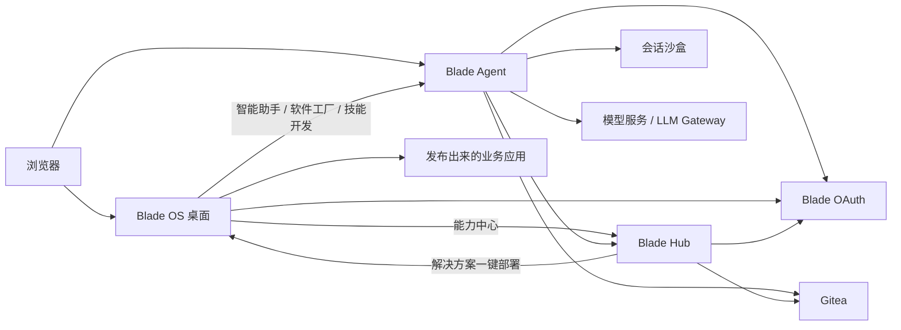
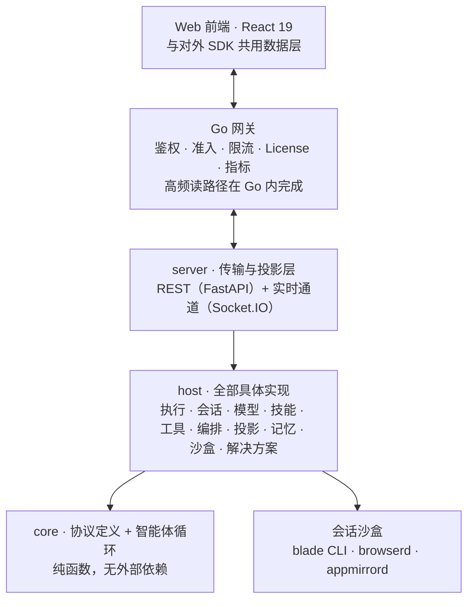
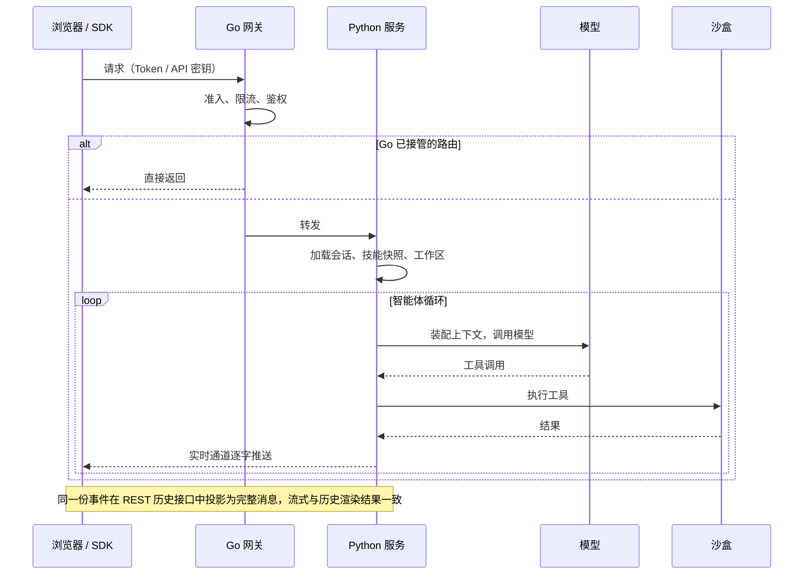

**智刃边端 · 领铄智能 · 版本线 2610**

## 摘要

Blade Agent 平台是一套面向企业业务人员的智能体工作平台。它的目标不是回答问题，而是替人把事情做完：读懂财务、法务、市场、产品经理手里的文件和系统，在受控的执行环境里动手处理，把结果以文件、报表、网页或应用的形式交付回来。

平台由三个产品组成：

| 产品 | 用户看到的是什么 | 承担的职责 |
|---|---|---|
| **Blade OS** | 浏览器里的桌面 | 统一入口、多窗口工作台、文件管理、应用市场、服务与应用管理 |
| **Blade Agent** | 智能助手、软件工厂、技能开发 | 会话、沙盒执行、工具与浏览器、记忆、多智能体、解决方案 |
| **能力中心（Blade Hub）** | 能力商店与治理台 | 技能、解决方案、插件、工作流、模板、知识库、数据源的发布、版本、安装与审核 |

它与两类常见产品的区别：

- **与聊天机器人的区别**：智能体有自己的执行环境（沙盒）、有文件系统、有命令行、有浏览器、能操作桌面软件，交付的是结果而不是建议。
- **与拖拽式工作流平台的区别**：不需要业务人员预先画流程。平台把业务背景、可用技能、历史经验和当前环境交给智能体，由它自己判断步骤；业务方法沉淀在"技能"里，而不是写死在流程图里。

平台支持三种部署形态：**离线一体机（Blade Agent Box）**、**私有化服务器**、**联网部署**。核心运行链路不依赖公网，离线断网环境可完整使用。

## 1 产品全景

### 1.1 三个产品与配套服务

配套服务不单独成章，但会在架构图中出现：

- **Blade OAuth**：统一登录、用户与用户池、API 密钥、License 校验、品牌定制配置的来源。
- **LLM Gateway**：模型源管理与调用转发，盒子内置模型与外部模型统一接入。
- **Gitea**：能力中心与软件工厂的底层仓库，负责版本、组织与权限。

### 1.2 三条典型用户旅程

**业务人员：把一件事交出去**
登录 Blade OS 桌面 → 打开「智能助手」→ 上传 Excel 或合同 → 描述要做什么 → 智能体在沙盒里读文件、写脚本、算结果 → 右侧预览区实时看到产出的报表或网页 → 下载或继续追问。

**业务骨干：把方法沉淀下来**
在「技能开发」里，把部门的操作规范、检查清单、常用模板整理成一个技能 → 发布到能力中心 → 同事在智能助手里直接调用；管理员可把它设为预装，新同事登录即有。

**产品经理：把想法做成应用**
在「软件工厂」里用一句话描述系统 → 智能体生成项目、写代码、起服务 → 在线预览与调整 → 一键发布 → 应用出现在 Blade OS 桌面和应用市场，团队直接打开使用。

## 2 核心能力

### 2.1 动作空间：智能体真的能动手

智能体的主运行环境是沙盒。每个用户拥有独立的沙盒，与其他用户完全隔离；沙盒预装了完整的数据分析与文档处理环境（Python、Office 文档依赖、中文字体），智能体在其中可以：

| 能力 | 说明 |
|---|---|
| **文件与文档** | 读写 Word / Excel / PPT / PDF，直接生成报表、图表与网页 |
| **命令与代码** | 在沙盒内执行命令、运行脚本，支持前台与后台任务 |
| **沙盒浏览器** | 内置浏览器，抓取网页、填表、核对页面变化；点击之后会核对页面是否真的发生了预期变化，不把"命令没报错"当成功 |
| **用户浏览器** | 通过浏览器插件，在用户本人已登录的浏览器里操作内部系统页面 |
| **任意桌面软件** | 把 GUI 软件的画面镜像到会话里，智能体用截图、点击、输入做像素级操作 |
| **远程机器** | 在用户接入的其他机器上执行命令、读写文件 |
| **外部系统** | 把企业已有的 MCP 服务、OpenAPI、GraphQL 接口一键变成命令行工具供智能体调用 |
| **定时任务** | 让智能体按计划自动执行，例如每周一早上生成周报 |

沙盒之外，智能体还能调用平台自身的能力：搜索与读取网页、派生子智能体、向用户提问、更新任务进度、渲染 HTML 预览。

**云电脑**：沙盒默认在会话结束后清理临时内容；「云电脑」模式让用户的沙盒持久化，安装的软件和文件长期保留，适合长期项目。

> 场景：财务月度对账。上传银行流水与账务导出表，智能体在沙盒里完成清洗、匹配、差异标注，输出带批注的 Excel 与一页差异摘要。

### 2.2 记忆：越用越懂你

- **跨会话记忆**：智能体会记住用户偏好、项目背景、常用术语和试错经验，后续会话自动参考。记忆分「我的记忆」与「角色共享」两类，用户可在「我的记忆」页查看、编辑、停用或删除。
- **会话内长任务**：上下文接近上限时自动压缩摘要；关键步骤可回溯到检查点。
- **会话与文件全局搜索**：跨会话检索历史对话与产出文件。

> 场景：第一次说"我的报表统一用 PDF、金额保留两位小数"，之后所有报表默认按这个规范输出。

### 2.3 能力中心：能力可沉淀、可分发、可治理

能力中心管理八类资源，全部以组织和个人空间隔离，底层由 Gitea 提供版本、权限与协作：

| 资源 | 用途 |
|---|---|
| **技能（Skill）** | 业务方法的封装单元：做什么、按什么顺序、注意什么。支持版本、正式版指针、版本差异、派生（fork）、点对点分享 |
| **解决方案（Solution）** | 面向岗位的智能体套装：角色 + 内置技能 + 初始化资源 + 可选专属界面；可一键部署为独立应用 |
| **插件** | 打包的技能与 MCP 工具组，安装后新会话自动可用 |
| **工作流** | 结构化的多步流程定义，分发时编译为可执行程序 |
| **Hook** | 在会话开始、工具调用前后等时机触发的钩子 |
| **软件工厂模板** | 带演示素材的项目起点 |
| **知识库** | 上传文档建库，全文检索；私有 → 待审 → 公开三态，管理员审核 |
| **数据源与工具** | 数据库、文件存储、邮箱、消息队列、MCP、HTTP 接口的连接配置与连通性测试 |

治理能力：

- **组织与私有空间**：每个用户有个人空间，可加入多个组织；权限由底层仓库真实判定。
- **精选与预装**：平台管理员维护精选技能库，可将技能标记为预装——新用户登录自动安装，之后新增的预装技能对老用户自动补装，用户主动卸载过的不再重复安装。
- **安装统计与成果墙**：按技能、按分类统计安装量与调用量。
- **知识库审核流**：公开知识库需管理员审核，可下架。

> 场景：法务部把「合同审查清单」做成技能并设为预装。全部门在智能助手里上传合同，智能体按清单逐项审查，输出风险表。

### 2.4 解决方案与角色：面向岗位的智能体

同一个解决方案下可以有多个角色，每个角色有自己的提示、初始工作模式和技能组合。用户在智能助手顶部选择解决方案与角色即可切换。

内置解决方案：

| 解决方案 | 用途 |
|---|---|
| 应用开发 | 在同一个沙盒里开发、启动、预览 Web 应用 |
| 专业设计 | 把产品需求变成可演示、可独立打开的原型 |
| 技能开发 | 编辑、调试、发布技能 |
| 智能标书 | 根据招标文件自动生成投标文件（独立应用形态，有专属界面） |
| Solution 制作 | 制作和发布可复用的解决方案包 |
| 运维助手 | 夜间流水线打盘、装机、测试的故障排查 |

解决方案可以从能力中心一键部署到 Blade OS，成为桌面上的独立应用。

### 2.5 软件工厂：说清需求就有应用

- **项目**：空白、模板或导入已有代码创建；每个项目有独立会话，智能体自动感知项目上下文。
- **任务看板**：待办 → 进行中 → 完成，支持任务汇报与审核；多名成员和多个智能体可以围绕同一个项目分工协作。
- **代码编辑与预览**：在线编辑、Git 彩色 diff、服务端口探测。
- **一键发布**：应用发布到 Blade OS，出现在桌面与应用市场。
- **发布后的运行保障**（由 Blade OS 提供）：每个应用默认 1 核 / 4 GB 资源限制（管理员可按应用特调）；下线默认保留数据卷 30 天，发新版本不删数据；可选域名模式对外访问。

> 场景：一句话生成值班排班系统，团队当天在桌面上开始用。

### 2.6 多智能体与工作模式

- **子智能体**：主智能体可派生子智能体承担子任务，并限定其可用工具与技能范围。
- **规划 / 执行两种模式**：先拆需求列计划再执行，或直接执行。
- **定时任务**：按日历计划自动触发会话。

### 2.7 Blade OS：桌面、应用市场与运行保障

- **桌面**：多窗口、任务栏、通知中心、拖拽布局与文件夹；每个应用独立容错，单个应用崩溃不影响桌面。
- **应用市场**：发布、分类、搜索、安装到桌面、评分评论、AI 评测摘要；可开启上架审核；按用户池隔离发布范围；可按用户池设置默认应用。
- **文件管理器与预览**：上传、下载、搜索，Word / Excel / PPT 浏览器端预览；按用户隔离。
- **服务与应用管理**：容器化应用的部署、探活、日志、终端、资源限制、守护与自动恢复。
- **新手指引**：三段演示视频，引导到智能助手、软件工厂、技能开发。
- **品牌定制**：Logo、壁纸、品牌名、浏览器标题、主题色（5 套预设），由 Blade OAuth 统一配置，三个产品同步生效。
- **国际化**：中文 / 英文。

## 3 典型场景

| 部门 / 行业 | 任务 | 智能体怎么做 | 交付物 |
|---|---|---|---|
| 财务 | 月度对账与异常明细 | 读取流水与账务表，匹配、标注差异，生成摘要 | 带批注的 Excel + 一页摘要 |
| 法务 | 合同批量比对 | 按审查清单技能逐份审查，抽取条款差异 | 风险清单 + 条款对照表 |
| 市场 | 竞品信息采集与周报 | 沙盒浏览器抓取公开信息，整理为周报并生成 PPT | PPT + 数据表 |
| 产品 | 需求到可演示原型 | 专业设计解决方案生成可点击原型 | 可独立打开的 HTML 原型 |
| 行政 / IT | 值班排班、报销整理、表单归集 | 软件工厂生成应用；高频事务流程技能化 | 桌面应用 + 可复用技能 |
| 运维 | 夜间流水线故障排查 | 运维助手解决方案读取日志定位问题 | 排查报告 |
| 数据分析 | 结构化数据与业务文件的分类分析 | 用分析技能完成清洗、处理、建模与可视化 | 分析报告 + 可视化页面 |
| 方案研判 | 基于态势、约束与规则的方案比选与推演 | 生成辅助分析结果，作为人机协同的辅助单元，不替代专业人员判断 | 方案对比表 + 推演结论 |
| 知识问答 | 部门制度、流程、历史资料问答 | 知识库检索 + 引用回答 | 带出处的答案 |

## 4 技术架构

### 4.1 分层

Blade Agent 采用清晰的分层结构，每一层只依赖下一层：

沙盒内有三个 Go 组件：`blade` 命令行（智能体在沙盒里通过它调用平台能力，27 个命令组）、`browserd`（浏览器画面镜像）、`appmirrord`（任意 GUI 软件镜像）。它们不映射宿主端口，仅容器网络内可达，鉴权由后端代理负责。

### 4.2 一次请求的生命周期

### 4.3 上下文工程

这是平台与"把提示词拼在一起"的方案最本质的差别。

- **统一注册的上下文来源**：平台、解决方案、工作模式、工具、技能、指令文件、运行环境、已连接的计算机、插件、沙盒描述、应用运行时、知识库、记忆、技能推荐等 18 组来源，各自声明内容、顺序与更新策略，由装配器按确定性顺序拼装。单个来源加载有超时预算，不会拖住整个请求。
- **上下文投影器**：对模型可见的历史做快照与去重。内容未变化不重复注入；可增量表达的状态只发差异；内容被移除时明确告知模型。每次再发布都附带一行原因（首次、已变更、重新装载、已恢复）。
- **薄角色提示 + 职责互斥的技能**：角色提示只保留身份、技能路由和运行环境；业务方法只存在于对应技能里。技能只写粗粒度流程、用户偏好和真实踩过的坑，不写模型本来就知道的细节。
- **记忆注入**：会话、技能、子智能体三条路径统一走一个协调器检索并注入相关记忆（默认上限 20 条），按作用域与权限过滤。
- **压缩与检查点**：长会话自动压缩；检查点支持回溯。

设计原则可以概括为：平台负责给智能体更好的上下文，而不是替它做决定。发现智能体偶尔选了不同路径时，先改提示、环境反馈和工具设计，不加服务端分支强制它。

### 4.4 沙盒与运行时

- **镜像**：统一的沙盒镜像（Bash / Python / C++ / Rust / 数据分析环境，含 Office 依赖与中文字体），部署方可定制并回滚。
- **资源限额**（管理员在「设置 → 运行时」调整）：每用户并行活跃会话数（默认 16）、持久与临时沙盒的内存与存储上限、CPU 核数上限、进程数上限、磁盘 IO 带宽与 IOPS 上限。
- **隔离**：按用户分沙盒、按会话分工作区；持久卷即租户边界；录屏等产物只落在用户自己的持久卷。
- **本地运行环境**：可选把执行转发到用户本机的守护进程（支持 Windows 与 POSIX 路径）。它不是沙盒的对等替代，适用范围需按场景确认。

### 4.5 三个产品之间的接口

| 方向 | 接口 | 说明 |
|---|---|---|
| OS → Agent | 外链 | 智能助手、软件工厂、技能开发在新标签页打开，不内嵌 |
| Agent → OS | 用户解析、图标搜索、用户创建钩子 | 用户文件目录以 OS 返回的用户 ID 为准；部署产物落到 OS 成为桌面应用 |
| Agent → Hub | 已安装技能列表、已安装插件 / 工作流 / Hook、知识库代理 | 内容带摘要指纹，不变不重装 |
| Hub → OS | 解决方案部署接口 | OS 拉取归档、解析部署清单、起容器、探活、注册桌面应用并守护 |
| 全部 → OAuth | Token 校验、License、用户池、品牌配置 | 非对称签名 Token，各服务本地校验 |

三个产品共用一张**服务地址表**，通过公开配置接口下发给浏览器；前端用 `blade-service://<服务名>/路径` 寻址，一体机换 IP 不需要改配置。

### 4.6 接入与扩展

**把智能体嵌进自己的系统**

| 方式 | 适用 |
|---|---|
| `@blade-hq/agent-react` | React 项目，开箱即用的聊天组件或自建界面 |
| `@blade-hq/agent-client` | Vue / Svelte / Node.js / 自建界面，浏览器与服务端通用 |
| `<blade-chat>` 静态脚本 | 纯 HTML 页面一行引入 |
| `blade-agent-kit`（Python） | 后端脚本：流式对话、无界面模式、文件上传 |

协议为 REST + Socket.IO。`GET /api/version` 公开可读，接入方按它钉死 SDK 版本。服务端不因 SDK 版本拒绝连接。详见[接入核心概念](../integration/concepts/)。

**宿主页面与智能体的双向桥接**：iframe 嵌入时通过 `postMessage` 通信，智能体可向宿主发出动作，宿主可向智能体追加上下文、追加输入或发送消息（白名单三种动作）。

**浏览器扩展**：在用户本人的浏览器里操作已登录页面，企业可私有分发。

**开发者扩展面**：技能、解决方案、插件、工作流、Hook、MCP 工具、自定义沙盒镜像、自定义业务 CLI（用开发者自己声明的命令名装进沙盒 PATH，平台不做包装）。详见[智能体开发核心概念](../agent-dev/concepts/)。

### 4.7 模型接入

- OpenAI 兼容协议，模型无关；支持多个 Provider 并切换。
- 自动探测模型能力：多模态输入、推理模式、上下文窗口、推理强度映射。
- 工具结果中的图片按模型方言处理（原生内联 / 用户消息 / 关闭）。
- 统一经 LLM Gateway 管理模型源；盒子内置模型与外部模型可同时配置。
- 语音输入（ASR）可接入火山引擎或 Qwen ASR。

## 5 部署与运维

### 5.1 三种部署形态

**离线一体机（Blade Agent Box）**
硬件、模型、平台、应用一体交付，开箱可用，数据不出域。适用于对保密、稳定、离线与响应速度有较高要求的现场。硬件与技术指标见附录 C。两台盒子可通过光纤直连，联合部署 DeepSeek V4 Flash。

**私有化服务器**
单镜像交付：进程管理器同时管理 nginx 与多个应用进程，nginx 直供静态资源并转发 API 与实时通道；健康检查 `/api/health`。数据库默认 SQLite，生产建议 PostgreSQL，schema 由迁移工具管理。多进程之间对共享资源的准备有明确的单点约定，避免互相覆盖。

**联网部署**
在私有化基础上按需启用外部模型、用户行为统计（缺省不开，配置缺席即零残留）、错误上报。核心运行链路不依赖任何外部 CDN 或互联网资源；字体与样式全部本地化。

### 5.2 服务与端口

| 服务 | 默认端口 | 用途 | 必需性 |
|---|---:|---|---|
| Blade OS | 80 | 桌面和应用入口 | 使用桌面时需要 |
| Blade Agent | 8020 | Web UI、REST、实时通道、会话与工作区 | 必需 |
| Blade Hub | 8010 | 技能与能力查询、安装、同步 | 使用能力中心时需要 |
| Blade OAuth | 19000 | 登录、身份、Token、License | 多用户部署需要 |
| LLM Gateway | 30000 | 模型源管理与调用转发 | 使用统一模型网关时需要 |
| Gitea | 30030 | 能力中心与软件工厂仓库 | 使用能力中心 / 软件工厂时需要 |
| Prometheus / Grafana | 9090 / 3000 | 指标采集与仪表盘 | 可选 |

部署步骤见 [Docker 部署](../ops/docker/)。

### 5.3 可观测性

三层能力，服务器与盒子各有取舍：

| 层 | 内容 | 服务器 | 盒子 |
|---|---|---|---|
| 指标 | `/metrics`：活跃会话、会话时长、各阶段耗时、首字延迟、事件循环延迟、逐路由 HTTP 耗时 | Prometheus + Grafana | 文本快照 |
| 链路 | 会话 / 模型请求 / 工具调用的完整链路，可接 Langfuse、Helicone 或 OTLP | Tempo / Jaeger | 本地 JSONL 诊断文件 |
| 性能剖析 | 进程级采样 | Pyroscope | `py-spy` 按需采样 |

盒子环境提供一键诊断包脚本。运营中心面向管理员展示会话总量、活跃会话、新增会话、活跃用户、模型调用与错误率、趋势、模型与服务、运行资源、会话控制台等。

### 5.4 浏览器兼容

能力中心镜像同时内置标准前端与低版本浏览器前端（Chromium 90 / Firefox 78），部署时一个开关切换，适配政企环境中的旧版内核。

### 5.5 版本与升级

- 三个产品统一采用「年月.次.修」版本号（如 v2608.0.9、v2610.0.2），约两个月切一条稳定线；稳定线只收缺陷修复，功能进入下一条线。
- 每个版本的[更新日志](../changelog/)写明前置条件、升级、回滚与已知限制。
- Blade Agent 与 Blade Hub 之间存在成对升级要求时，更新日志会明确标注，需一起升级或一起回滚。
- SDK 版本与服务端版本对应，通过 `GET /api/version` 核对。

## 6 安全与数据边界

### 6.1 身份与权限

- 统一登录由 Blade OAuth 提供，Token 采用非对称签名，各服务从 OAuth 获取公钥本地校验；支持跨服务登出。
- API 密钥（`sk-blade-v3-` 前缀）适合后端服务接入，明文只在创建时返回一次，可按用户或服务分别创建与吊销。
- 管理员身份跟随 OAuth 的声明，不依赖登录顺序。
- 多租户载体是 OAuth 的**用户池**：应用市场按池隔离发布范围，池管理员只能治理自己的池；能力中心按组织与个人空间隔离，权限由底层仓库真实判定。
- License 校验为 fail-close：校验不可用时拒绝新请求，已在线会话有宽限。

### 6.2 平台安全不变量

只有四类问题用强制权限与服务端隔离保证：

1. 跨用户隔离
2. 鉴权与密钥
3. 任意代码执行边界
4. 数据不可逆损坏

其余的工作方法与误操作风险，用提示词、技能、工具反馈和可恢复的检查来解决。智能体被视为可信但会犯错的协作者；它处理的外部内容与执行的项目代码仍是不可信输入，沙盒与租户隔离对其始终生效。

### 6.3 沙盒边界

- Docker 容器隔离 + 资源上限（内存、存储、CPU、进程数、IO）。
- 沙盒内的浏览器与 GUI 镜像服务不映射宿主端口，仅容器网络内可达。
- 挂载校验：不把宿主机根目录、SSH 密钥或云凭证挂进沙盒；除非部署方案明确需要，不暴露 Docker Socket。
- 智能体可访问进程权限范围内的绝对路径，因此文件系统权限必须在容器层收紧。
- Blade OS 需要宿主 Docker Socket 以管理应用容器，该权限等价于宿主 root，建议仅在可信内网部署。

### 6.4 数据放在哪里

| 数据 | 位置 | 运维动作 |
|---|---|---|
| 会话文件与工作区 | Blade Agent 持久化目录 | 备份、容量监控、按组织保留策略 |
| 用户文件 | Blade OS 用户目录，按用户隔离 | 持久卷权限、删除流程 |
| 技能快照 | Blade Agent 技能目录 | 随版本备份 |
| 身份与 Token 元数据 | Blade OAuth 与各服务数据库 | 限制管理端访问，建立吊销流程 |
| 模型请求 | Blade Agent / LLM Gateway；是否出网取决于模型源 | 核对模型地址、日志与链路后端 |
| 能力中心内容 | Gitea 与 Hub 数据库 | 备份仓库，限制组织权限 |
| 软件工厂代码 | Gitea 与项目工作区 | 备份仓库 |
| 应用数据卷 | Blade OS 管理，下线后保留 30 天 | 到期自动回收 |

### 6.5 模型出网与日志

- 使用公网模型时，会话内容、技能、系统提示与工具结果会发往配置的模型地址；使用盒子内模型时也应检查网关是否配置了公网回退源。
- 出网白名单应覆盖模型源、技能调用的外部接口和浏览器访问目标。
- 链路追踪后端可能记录完整 prompt 与工具输入输出，接入前先定脱敏与保留周期。
- 审计：Blade OS 统一记录登录、市场安装、审核、引导、卷回收等事件。跨服务的不可篡改审计需在网关、OAuth、容器平台与目标业务系统分别留痕。

### 6.6 源码保护

正式镜像将核心 Python 模块编译为原生扩展；技能、配置和模板保持可读便于调试。这项措施保护厂商源码，不替代上述权限与网络控制。

### 6.7 能力边界

平台能执行命令与网页操作，但不能消除外部系统的不确定性：登录会过期、页面会变、模型会返回空响应。涉及删除、付款、发布或权限修改的动作，应保留人工确认与回滚路径。平台不替部署方做业务权限设计与数据合规判断。

### 6.8 上线检查

| 检查项 | 通过标准 |
|---|---|
| 管理员 | OAuth 中有明确的管理员声明 |
| API 密钥 | 每个服务单独建密钥，可吊销 |
| 工作区 | 持久卷权限、备份和删除周期已确定 |
| 模型出网 | 模型地址和回退源已列入审批范围 |
| 沙盒 | 无高风险宿主机挂载，无多余 capability |
| 日志 | 模型 payload 和工具结果的访问、脱敏、保留期已配置 |
| 高风险动作 | 技能中写明确认和回滚步骤 |

更多细节见[安全与数据边界](../ops/security/)。

## 7 版本状态与路线图

### 7.1 当前版本

| 产品 | 稳定线 | 当前开发线 |
|---|---|---|
| Blade Agent | v2608.0.9 | v2610.0.0-rc |
| Blade OS | v2610.0.2 | v2610.0.0-beta |
| Blade Hub | v2608.0.x | v2610.0.0-beta |

### 7.2 近期已落地

- 能力中心：精选技能与预装机制、插件自由目录、低版本浏览器前端、品牌定制
- Blade OS：应用市场上架审核与用户池隔离、按池默认应用、应用资源限制、下线保留数据、新手指引视频、品牌定制
- Blade Agent：GUI 软件镜像与像素级操作、远程机器执行、Go 网关切流、多 Provider 模型管理、运营中心

### 7.3 路线图

- **多人多智能体协同**：多个用户与多个智能体在同一任务空间分工协作，任务、产物与审批在一处流转。
- **单人操控百台机器**：在智能体的帮助下，一个人同时管理和驱动上百台已接入的机器执行任务。
- **7×24 无间断智能体**：智能体长期在线，按计划与事件自主推进工作，人只在需要时介入。
- **快慢智能体协同**：快速响应的轻量智能体处理即时交互，深度推理的智能体处理复杂任务，两者协同分工。

## 8 附录

### 附录 A 术语表

| 术语 | 含义 |
|---|---|
| 会话 | 一次智能体交互的完整上下文：消息、工具调用记录、工作区文件 |
| 工作区 | 每个会话独立的文件目录 |
| 沙盒 | 用户的隔离执行环境 |
| 云电脑 | 持久化的用户沙盒 |
| 技能 | 业务方法的封装单元 |
| 解决方案 | 面向岗位的智能体套装：角色 + 技能 + 资源 + 界面 |
| 角色 | 解决方案下的一种身份与技能组合 |
| 能力中心 | 技能与各类能力的发布、版本、安装与治理平台 |
| 用户池 | 统一身份中的用户分组，是多租户隔离的载体 |
| 软件工厂 | 用自然语言创建、迭代、发布应用的工作台 |
| 记忆 | 跨会话保留的用户偏好、背景与经验 |
| 规划模式 / 执行模式 | 只列计划不执行工具 / 调用工具完成动作 |

### 附录 B 文档与接口索引

- [快速开始](../guide/getting-started/)、[Blade OS 桌面](../guide/blade-os/)
- [接入核心概念](../integration/concepts/)、[REST 接口](../api/rest/)、[WebSocket 接口](../api/websocket/)、[会话生命周期](../api/session-lifecycle/)
- [智能体开发核心概念](../agent-dev/concepts/)、[SKILL.md 编写规范](../agent-dev/skill/skill-md/)、[解决方案目录结构](../agent-dev/solution/structure/)、[插件开发概览](../agent-dev/plugin/overview/)
- [架构与边界](../ops/architecture/)、[Docker 部署](../ops/docker/)、[环境变量参考](../ops/env/)、[监控与观测](../ops/monitoring/)、[安全与数据边界](../ops/security/)、[沙箱镜像定制](../ops/sandbox/)

### 附录 C 硬件配置与技术指标（Blade Agent Box）

| 项目 | 说明 |
|---|---|
| 整机尺寸 | 150 × 150 × 50.5 mm |
| 供电与功耗 | 220V / 170W |
| 典型接口 | USB / HDMI / RJ-45 / GbE |
| 网络能力 | 1 路 RJ-45 10GbE |
| CPU | 20 核 ARM |
| GPU | GB10 |
| AI 算力 | 1 PFLOPS FP4 |
| 内存 | 128 GB |
| 存储 | 1 TB |
| 上下文长度 | 128K |
| 内置模型规模 | 35B / 122B |
| 并发能力 | 4 路典型并发 |
| 双机部署 | 两台盒子光纤直连，联合部署 DeepSeek V4 Flash |
| 技能能力 | 300+ 可复用技能 |

部署方式：单机部署、局域网共享访问、与知识库 / 业务系统 / 数据源组合的场景化集成部署。

## 结语

Blade Agent 平台把"可部署的大模型能力"转化为"可落地的业务能力"：Blade OS 给业务人员一个熟悉的桌面，Blade Agent 给他们一个真能动手的智能体，能力中心让组织的方法与经验沉淀为可复用、可治理的资产。从一台盒子开始，也可以从一台服务器开始，逐步构建本地化、可持续演进的智能应用体系。
